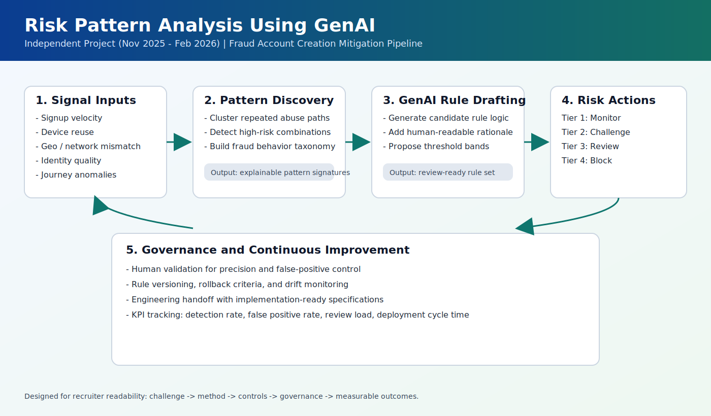

# Risk Pattern Analysis Using GenAI

**Duration:** Nov 2025 - Feb 2026  
**Type:** Independent Project  
**Focus Area:** Fraud Prevention, Risk Analytics, GenAI-Assisted Decisioning

## Executive Summary
This project demonstrates how GenAI can support fraud prevention by accelerating the conversion of behavioral abuse patterns into deployable risk controls. The work is centered on fraudulent account creation, where attackers adapt quickly and static rules become outdated.

The solution combines behavioral analysis, GenAI-assisted rule drafting, and human risk review to produce actionable controls that are explainable, versioned, and implementation-ready for engineering teams.

## Business Problem
Organizations with open registration flows are exposed to fake account creation used for scams, bonus abuse, spam campaigns, synthetic identity testing, and downstream payment fraud. Traditional static rule systems struggle because:
- Attack behavior changes rapidly.
- Signal quality varies across channels.
- High false positives can block legitimate users and hurt conversion.

## Project Goals
- Detect suspicious signup behavior earlier in the account lifecycle.
- Reduce fraud leakage while controlling false positives.
- Create a repeatable rule design process that can evolve with attacker behavior.
- Improve handoff quality from risk analysis to engineering implementation.

## Scope
- Signup and early-session risk signals.
- Behavioral pattern mining of likely bad actors.
- GenAI-assisted generation of candidate rules and rule explanations.
- Prioritization framework for preventive controls.
- Governance model for safe rollout (versioning, rollback, monitoring).

## Methodology
1. **Signal Mapping and Normalization**
   - Consolidated high-value indicators from registration and early activity.
   - Normalized fields for consistent analysis across different event sources.
2. **Pattern Discovery**
   - Identified repeated abuse pathways such as velocity bursts, device reuse clusters, and location inconsistencies.
   - Grouped related behaviors into attack-pattern segments.
3. **GenAI-Assisted Rule Design**
   - Used GenAI to convert discovered patterns into candidate rule logic.
   - Generated interpretable rationales for each rule to support review and audit.
4. **Risk Review and Calibration**
   - Added review checkpoints for precision, operational safety, and explainability.
   - Calibrated thresholds into policy tiers: monitor, challenge, manual review, block.
5. **Implementation Planning**
   - Converted accepted rules into engineering-ready specifications.
   - Defined rollout strategy with guardrails, rollback conditions, and success metrics.

## Signal Categories Used
- **Behavioral Velocity:** rapid signup attempts per IP/device/session pattern.
- **Device and Network Risk:** device reuse, proxy/VPN anomalies, network reputation.
- **Identity Quality:** disposable email patterns, synthetic profile signals, mismatched metadata.
- **Journey Integrity:** abnormal navigation flow, scripted interaction patterns, repeat failure loops.

## Rule Framework
- **Tier 1 (Low Risk):** log and monitor for emerging patterns.
- **Tier 2 (Medium Risk):** introduce progressive friction (step-up verification).
- **Tier 3 (High Risk):** hold for review or apply temporary restrictions.
- **Tier 4 (Critical Risk):** hard block with case evidence retained for audit.

## Deliverables
- Pattern taxonomy for fraudulent account creation behaviors.
- GenAI-assisted rule library draft with human-reviewed acceptance criteria.
- Risk scoring strategy and threshold policy matrix.
- Implementation guidance for engineering deployment and control lifecycle management.

## What Recruiters Should Take From This
This project demonstrates practical capability in:
- Turning ambiguous fraud behavior into structured risk controls.
- Applying GenAI beyond chat use cases into decision-support workflows.
- Balancing fraud detection effectiveness with customer experience risk.
- Producing implementation-ready outputs suitable for cross-functional teams.

## Impact Measurement (Template)
Use this section with real values when available:
- **Fraud Attempt Detection Rate:** `+X%` improvement after new rules.
- **False Positive Rate:** `-Y%` reduction via threshold calibration.
- **Time-to-Rule Deployment:** reduced from `A days` to `B days`.
- **Manual Review Load:** `-Z%` through better rule precision.

## Professional Resume Entry
**Risk Pattern Analysis Using GenAI, Independent Project | Nov 2025 - Feb 2026**
- Designed GenAI-assisted rules for long-term mitigation of fraudulent account creation.
- Analyzed bad-actor behavioral patterns to generate prioritized fraud prevention insights.
- Defined implementation-ready preventive mechanisms aligned with engineering deployment workflows.

## Repository Structure
- `README.md` - detailed project narrative and framework
- `docs/project-summary.md` - one-page recruiter-friendly overview
- `docs/resume-entry.md` - polished resume and ATS bullet variants
